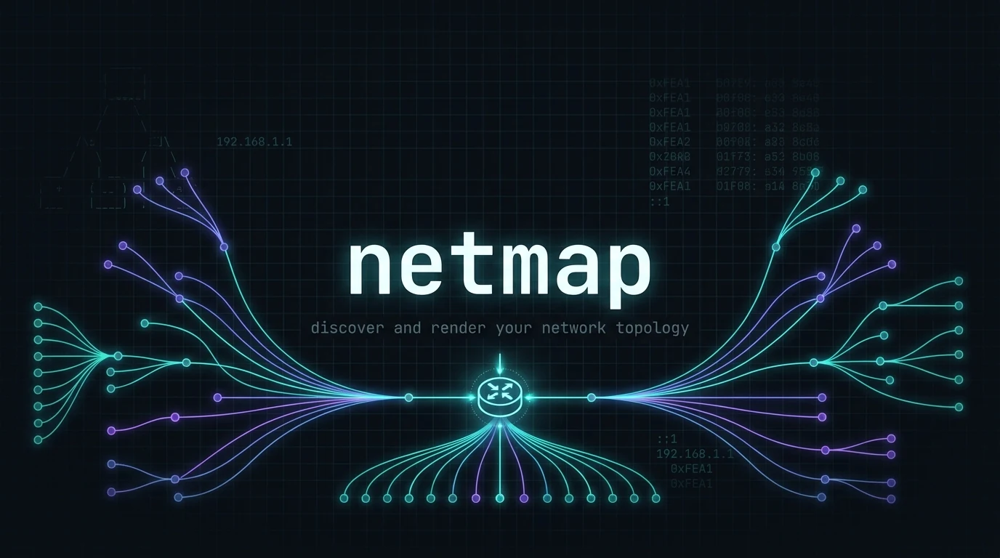

<p align="center">
  
</p>

<p align="center">
  <a href="https://github.com/aurelioochoa/netmap/actions/workflows/ci.yml"></a>
  
  
</p>

# netmap

Discovers the devices on your network and draws the topology — as an ASCII diagram in
your terminal, as an SVG, or in an interactive desktop app.

It combines four scanner backends (`ip neigh`, `arp-scan`, `nmap`, `traceroute`) into a
single host graph, infers each device's role (router, switch, wap, server, workstation,
IoT), and renders the result.

```
Internet
   |
router
   |
switch
   |
wap/switch - wap/switch (mesh-ap) - server :80 :443
     |                 |
wap/switch - workstation (tower) - workstation (desktop)
     |                |
server :22 :8080 - workstation (laptop)
```

## Quick start

```bash
git clone https://github.com/aurelioochoa/netmap
cd netmap
./install.sh                        # system deps + release build + symlink
netmap scan 192.168.1.0/24 --sudo
```

Run `make` on its own to see every available command.

## Desktop GUI

```bash
make gui            # run it
make install-gui    # or install it to /usr/local/bin
```

The GUI runs the same scanning pipeline as the CLI and streams results in as they are
found — hosts appear on the canvas during the scan rather than all at once at the end.

- **Interactive canvas** — pan, zoom, drag nodes, click to select. Node positions come
  from the same layout engine the SVG exporter uses, so what you see is what you export.
- **Live progress** — current stage, per-host progress bar, and a log pane.
- **Cancel** — stops a running scan and kills its child processes.
- **Host list** with filtering by IP, hostname, vendor, or role.
- **Export** to JSON, SVG, or the plain ASCII tree; **open** a previously saved scan.

> `--sudo` shells out to `sudo`, which has no terminal to prompt in when launched from a
> desktop environment. Either configure a password-less rule for `arp-scan`/`nmap`, or
> grant the capabilities directly:
> `sudo setcap cap_net_raw,cap_net_admin+eip $(which nmap)`

## CLI

```
netmap scan <target> [OPTIONS]
  --ports <range>        Port range for nmap (e.g. "1-1024")
  --sudo                 Prepend sudo to backends that require root
  --timeout <sec>        Per-host probe budget; 0 disables it [default: 120]
  --max-parallel <n>     Hosts probed concurrently [default: 10]
  --output <file>        Write .json or .svg
  --skip <backend>       Skip: ip-neigh, arp-scan, nmap, traceroute (comma-separated)
  --show-off-target      Keep hosts outside the target CIDR
  -v, -vv                More logging;  -q  silences it

netmap render <scan.json> [--output <file>]   Re-render a saved scan, no network access
netmap config path | init | show              Manage the config file
```

Ctrl-C cancels a running scan, prints whatever was found so far, and kills any child
`nmap`/`traceroute` processes.

### Configuration

Settings can live in a file instead of on the command line. Precedence is
**CLI flag > config file > built-in default**.

```bash
netmap config init     # write a commented starter file
netmap config path     # show where it lives
netmap config show     # show the effective settings
```

```toml
# ~/.config/netmap/config.toml
target       = "192.168.1.0/24"
sudo         = true
timeout      = 120
max-parallel = 10
skip         = ["traceroute"]
```

Set `NETMAP_CONFIG` to point at a different file.

## How it works

Five stages, each merging into one `HostGraph`:

| Stage | Tool | Contributes |
|---|---|---|
| 1 | `ip neigh` / `arp -an` | Neighbour-cache entries: IP + MAC |
| 2 | `arp-scan -l` | Active ARP sweep: IP + MAC + vendor |
| 3 | `nmap -sn` | Host discovery across the target |
| 4 | `nmap -sV [-O]` | Open ports, services, OS guess (per host) |
| 5 | `traceroute -n` | Hop edges, and hence the topology (per host) |

A backend that is missing or fails is logged and skipped — it never aborts the scan.
When traceroute yields no edges, netmap synthesises a star around the detected gateway
and says so, in both the log and the GUI, because that shape is inferred rather than
measured.

## Development

```bash
make          # list every command
make verify   # fmt check + clippy -D warnings + tests
make test
make lint
```

The crate is split so the scanning logic is reusable:

```
src/lib.rs        public API
  model.rs        HostGraph, Host, Port, DeviceRole  (Serialize + Deserialize)
  backends/       ScanBackend trait + the four implementations
  pipeline.rs     stage orchestration, merge, role inference
  layout.rs       graph geometry, shared by SVG and GUI
  renderer/       ASCII tree, ports table, SVG
  progress.rs     ScanEvent stream for incremental UIs
  config.rs       config-file loading
src/main.rs       the CLI
gui/              the egui desktop app
```

Embedding it:

```rust
use netmap::{backends::ScanOptions, pipeline, renderer};

let graph = pipeline::run_pipeline("192.168.1.0/24", &ScanOptions::default()).await?;
print!("{}", renderer::render_tree(&graph));
```

## Docker

```bash
docker compose up               # run a scan
make docker                     # rebuild the image
```

The container runs with `NET_RAW`/`NET_ADMIN` and `network_mode: host` so the ARP-based
backends see the real LAN. The image is CLI-only; the GUI is not included.

## Requirements

- Rust toolchain
- `nmap`, `arp-scan`, `traceroute`, and `iproute2` (Linux) or `arp` (macOS)
- For the GUI on Linux: `libgtk-3`, `libxkbcommon` and the usual desktop graphics libraries

`install.sh` handles the system dependencies; `build.rs` warns at compile time about any
scanner binary it cannot find.

## License

MIT
